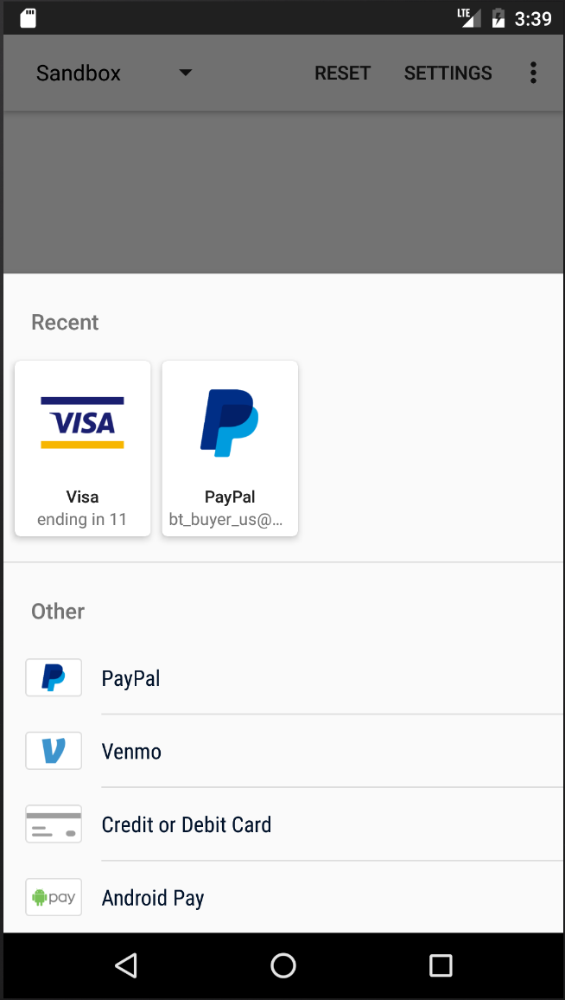

# Braintree Android Drop-In

[](https://travis-ci.org/braintree/braintree-android-drop-in)

Braintree Android Drop-In is a readymade UI that allows you to accept card and alternative payments in your Android app.



## What's new in 3.0

* All new UI and integration for Drop-In
* Fetch a customer's saved payment method without showing UI
* Added UnionPay support to Drop-In

Please create an [issue](https://github.com/braintree/braintree-android-drop-in/issues) with any comments or concerns.

## Adding it to your project

Add the dependency in your `build.gradle`:

```groovy
dependencies {
  implementation 'com.braintreepayments.api:drop-in:4.5.0'
}
```

To use the latest build from the `master` branch use:

```groovy
dependencies {
  implementation 'com.braintreepayments.api:drop-in:4.5.1-SNAPSHOT'
}
```

## Usage

Create a `DropInRequest` and use the `Intent` to start Drop-In:

```java
DropInRequest dropInRequest = new DropInRequest()
    .clientToken(mClientToken);
startActivityForResult(dropInRequest.getIntent(context), DROP_IN_REQUEST);
```

Handle the response:

```java
@Override
public void onActivityResult(int requestCode, int resultCode, Intent data) {
    super.onActivityResult(requestCode, resultCode, data);

    if (requestCode == DROP_IN_REQUEST) {
        if (resultCode == RESULT_OK) {
            DropInResult result = data.getParcelableExtra(DropInResult.EXTRA_DROP_IN_RESULT);
            String paymentMethodNonce = result.getPaymentMethodNonce().getNonce();
            // send paymentMethodNonce to your server
        } else if (resultCode == RESULT_CANCELED) {
            // canceled
        } else {
            // an error occurred, checked the returned exception
            Exception exception = (Exception) data.getSerializableExtra(DropInActivity.EXTRA_ERROR);
        }
    }
}
```

### 3D Secure + Drop-in

The new Drop-In supports 3D-Secure verification. Assuming you have [3D-Secure configured](https://developers.braintreepayments.com/guides/3d-secure/configuration) for your account, enable it in your client with `DropInRequest.requestThreeDSecureVerification(true)` and set an amount. Then, create a ThreeDSecureRequest() object, setting `ThreeDSecurePostalAddress` and `ThreeDSecureAdditionalInformation` fields where possible; the more fields that are set, the less likely a user will be presented with a challenge. For more information, check our [3D Secure Migration Guide](https://developers.braintreepayments.com/guides/3d-secure/migration/android/v3#getting-ready-for-3ds-2). Make sure to attach this object to the `BTDropInRequest` before use.

```java
ThreeDSecurePostalAddress billingAddress = new ThreeDSecurePostalAddress()
    .givenName("Jill")
    .surname("Doe")
    .phoneNumber("5551234567")
    .streetAddress("555 Smith St")
    .extendedAddress("#2")
    .locality("Chicago")
    .region("IL")
    .postalCode("12345")
    .countryCodeAlpha2("US");

ThreeDSecureRequest threeDSecureRequest = new ThreeDSecureRequest()
    .amount("1.00")
    .versionRequested(ThreeDSecureRequest.VERSION_2)
    .email("test@email.com")
    .mobilePhoneNumber("3125551234")
    .billingAddress(billingAddress)
    .additionalInformation(additionalInformation);


// Optional additional information.
// For best results, provide as many of these elements as possible.
ThreeDSecureAdditionalInformation additionalInformation = new ThreeDSecureAdditionalInformation()
    .accountId("account-id");

DropInRequest dropInRequest = new DropInRequest()
    .clientToken(mAuthorization)
    .requestThreeDSecureVerification(true)
    .threeDSecureRequest(threedSecureRequest);
```

### Fetch last used payment method

If your user already has an existing payment method, you may not need to show Drop-In. You can check if they have an existing payment method using `DropInResult#fetchDropInResult`. Note that a payment method will only be returned when using a client token created with a `customer_id`.

```java
DropInResult.fetchDropInResult(activity, clientToken, new DropInResult.DropInResultListener() {
    @Override
    public void onError(Exception exception) {
        // an error occurred
    }

    @Override
    public void onResult(DropInResult result) {
        if (result.getPaymentMethodType() != null) {
            // use the icon and name to show in your UI
            int icon = result.getPaymentMethodType().getDrawable();
            int name = result.getPaymentMethodType().getLocalizedName();

            if (result.getPaymentMethodType() == PaymentMethodType.GOOGLE_PAY) {
                // The last payment method the user used was GooglePayment. The GooglePayment
                // flow will need to be performed by the user again at the time of checkout
                // using GooglePayment#requestPayment(...). No PaymentMethodNonce will be
                // present in result.getPaymentMethodNonce(), this is only an indication that
                // the user last used GooglePayment.
            } else {
                // show the payment method in your UI and charge the user at the
                // time of checkout using the nonce: paymentMethod.getNonce()
                PaymentMethodNonce paymentMethod = result.getPaymentMethodNonce();
            }
        } else {
            // there was no existing payment method
        }
    }
});
```

### card.io

To offer card scanning via [card.io](https://card.io), add the dependency in your `build.gradle`:

```groovy
dependencies {
    implementation 'io.card:android-sdk:5.+'
}
```

Drop-In will include a menu icon to scan cards when card.io is included.

## Help

* [Read the javadocs](http://javadoc.io/doc/com.braintreepayments.api/drop-in/)
* [Read the docs](https://developers.braintreepayments.com/guides/drop-in/android/v2)
* Find a bug? [Open an issue](https://github.com/braintree/braintree-android-drop-in/issues)
* Want to contribute? [Check out contributing guidelines](CONTRIBUTING.md) and [submit a pull request](https://help.github.com/articles/creating-a-pull-request).

## Feedback

Here are a few ways to get in touch:

* [GitHub Issues](https://github.com/braintree/braintree-android-drop-in/issues) - For generally applicable issues and feedback
* [Braintree Support](https://articles.braintreepayments.com/) / [support@braintreepayments.com](mailto:support@braintreepayments.com) -
for personal support at any phase of integration

## Releases

Subscribe to our [Google Group](https://groups.google.com/forum/#!forum/braintree-sdk-announce) to
be notified when SDK releases go out.

## License

Braintree Android Drop-In is open source and available under the MIT license. See the [LICENSE](LICENSE) file for more info.
